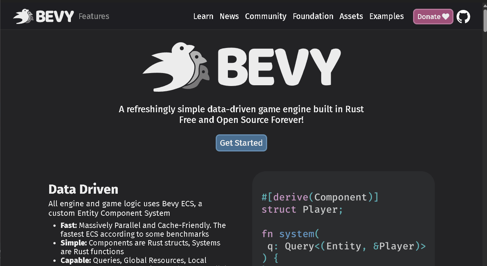
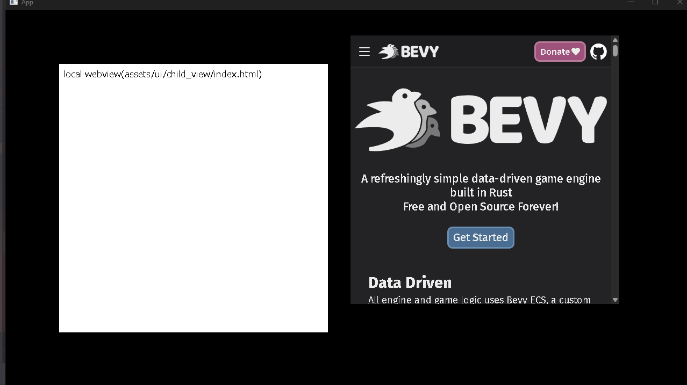

# bevy_webview_wry

[](https://crates.io/crates/bevy_webview_wry)
[](https://github.com/not-elm/bevy_webview_wry#license)

> [!CAUTION]
> This crate is in the early stages of development and is subject to breaking changes.

## Purpose

The purpose of this crate is integrate [bevy](https://github.com/bevyengine/bevy)
and [wry](https://github.com/tauri-apps/wry) using [bevy_flurx](https://github.com/not-elm/bevy_flurx).

## Supported platforms

| Platform       | usable |
|----------------|--------|
| Windows        | ✅      |
| MacOS          | ✅      |
| Linux(X11)     | ✅      |
| Linux(Wayland) | ❌      |
| Web            | ❌      |
| Android        | ❌      |
| iOS            | ❌      |

## Setup

### Main process(bevy)

Add this to your `Cargo.toml`:

```toml
[dependencies]
bevy_webview_wry = { version = "0.4", features = ["api"] }

# necessary if you want to use ipc-command.
bevy_flurx = "0.11"
```

### Ui process(webview)

Execute the following command in the directory where the `package.json` is located.

```shell
# if you use npm
npm install bevy_flurx_api
# if you use yarn
yarn add bevy_flurx_api
# if you use pnpm
pnpm install bevy_flurx_api
```

Or, you can also use the API directly from `Window.__FLURX__` without installation.

## Usage

There are two ways to create a webview:

### Converts an existing window into a webview window.

[examples/simple.rs](./examples/simple.rs)


```rust
fn spawn_webview(
    mut commands: Commands,
    window: Query<Entity, With<PrimaryWindow>>,
) {
    // Converts the `Window` attached the entity into a webview window. 
    commands
        .entity(window.single())
        .insert(Webview::Uri(WebviewUri::new("https://bevyengine.org/")));
}
```

### Child window

This feature is required `child_window` feature flag.

Please refer [here](https://github.com/not-elm/bevy_child_window) for supported platforms.

[examples/child_window.rs](./examples/child_window.rs)


### Embedding Webview in a Window (Experimental)

[examples/wry/embedding.rs](examples/embedding.rs)


## Ipc

### IpcTrigger

You can listen to messages from the webview as a trigger.

[examples/event_listen.rs](./examples/ipc_trigger.rs)

### Emit event to webview

[examples/emit_event_to_webview.rs](./examples/emit_event_to_webview.rs)

### IpcCommand

`IpcComamnd` can be divided into two command patterns: action-command, task-command

Please check  [examples/ipc_command.rs](./examples/ipc_command.rs) for details.

## ChangeLog

Please see [here](https://github.com/not-elm/bevy_webview_wry/blob/main/CHANGELOG.md).

## Feature flags

| flag           | description                                 | default |
|----------------|---------------------------------------------|---------|
| `child_window` | allows you to create embedding child window | true    |
| `api`          | provides api plugins for the webview        | false   |

## Compatible Bevy versions

| bevy_webview_wry | bevy_flurx | bevy |
|------------------|------------|------|
| 0.4.0 ~          | 0.11       | 0.16 |
| 0.1.0 ~          | 0.9        | 0.15 |

## License

This crate is licensed under the MIT License or the Apache License 2.0.

## Todo

- [ ] Support Linux(Wayland)